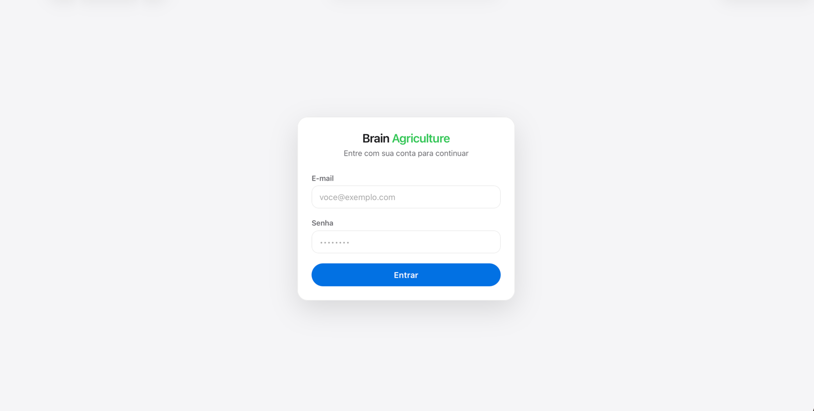
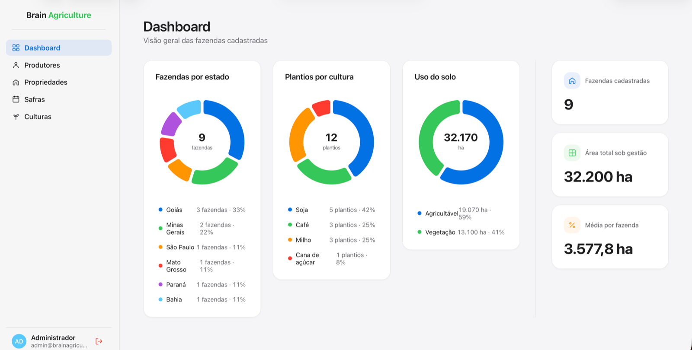
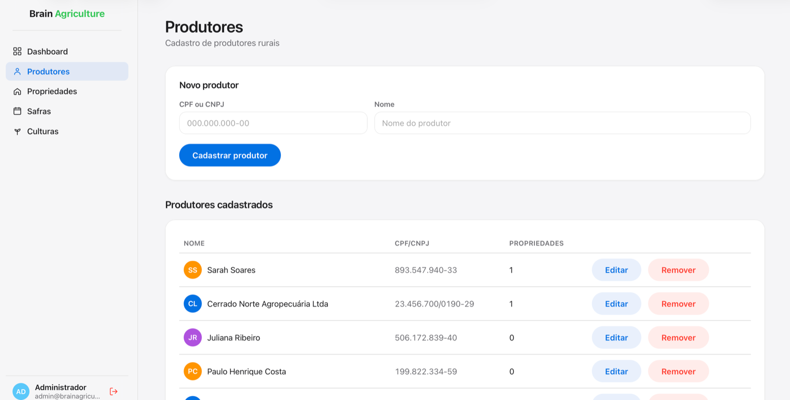
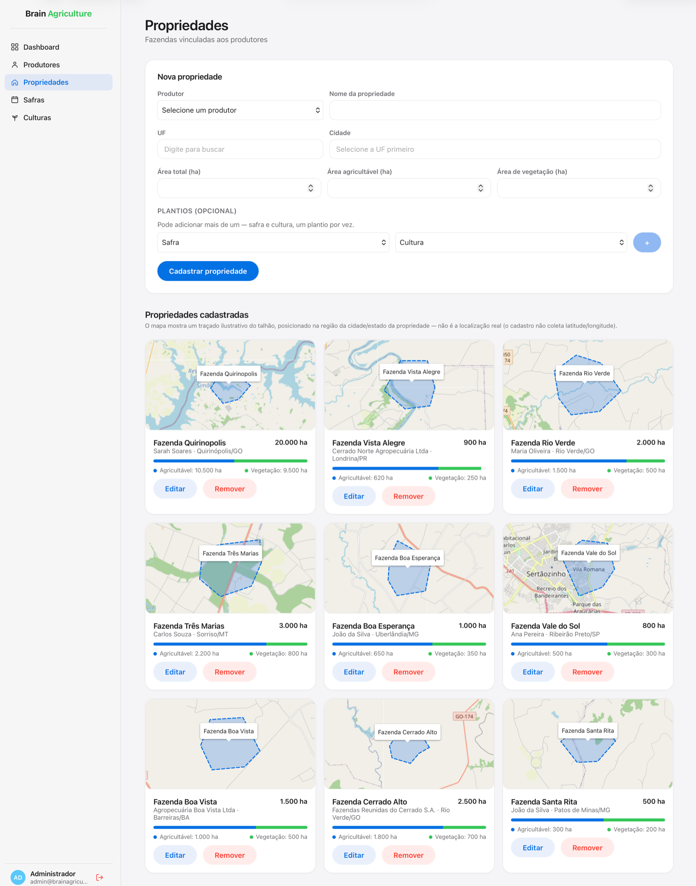
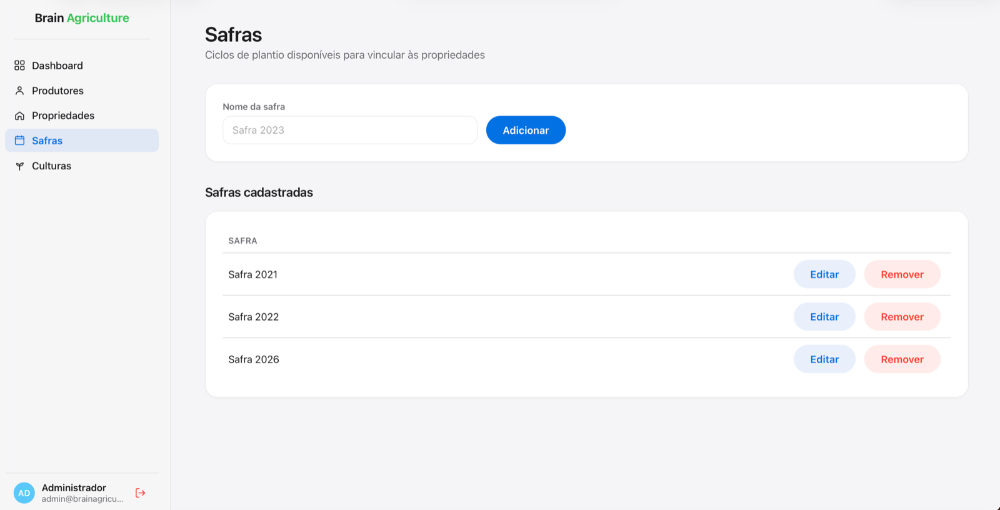
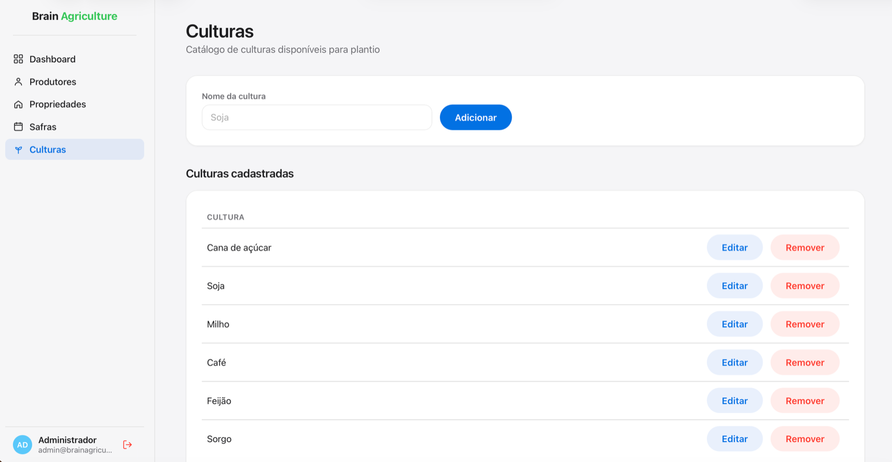

# Brain Agriculture — Gestão de Produtores Rurais

Aplicação fullstack para cadastro de produtores rurais, suas propriedades, safras e
culturas plantadas, com um dashboard de indicadores. Desenvolvida como parte do teste
técnico da Brain Agriculture.

> **Status:** núcleo funcional completo (backend + frontend). Este README acompanha o
> progresso — a seção [Checklist](#checklist) reflete o que já está pronto.

## Stack

- **Backend:** Node.js + TypeScript + NestJS + TypeORM + PostgreSQL
- **Autenticação:** JWT (Passport) — login simples com usuário seedado
- **Frontend:** React + TypeScript + Redux Toolkit (Query) + Styled Components +
  Nivo (`@nivo/pie`, gráficos) + React-Leaflet/OpenStreetMap (mapa ilustrativo da propriedade)
- **Infra:** Docker + Docker Compose
- **Testes:** Jest (backend e frontend) + React Testing Library
- **Documentação da API:** Swagger/OpenAPI (`/docs` quando o backend está rodando)

## Screenshots

| Tela | Preview |
| --- | --- |
| Login |  |
| Dashboard |  |
| Produtores |  |
| Propriedades (mapa) |  |
| Safras |  |
| Culturas |  |

## Estrutura do projeto

```
brain-agriculture/
├── backend/          # API REST (NestJS)
│   └── src/
│       ├── common/           # filtros, validadores, interceptors compartilhados
│       ├── config/           # configuração de banco de dados
│       ├── database/seeds/   # script de dados mockados (inclui usuário admin)
│       └── modules/
│           ├── auth/                 # login JWT, JwtStrategy, guard global
│           ├── usuarios/             # entidade Usuario (login)
│           ├── produtores/
│           ├── propriedades/
│           ├── safras/
│           ├── culturas/
│           ├── culturas-plantadas/   # associação Propriedade x Safra x Cultura
│           ├── dashboard/
│           └── geocoding/            # geocodificação do município (proxy pro Nominatim)
├── frontend/         # SPA (React + Redux Toolkit Query)
│   └── src/
│       ├── app/                # store Redux + api slice (RTK Query) + authSlice (JWT)
│       ├── components/{atoms,molecules,organisms,templates}/  # atomic design
│       ├── pages/               # Login, Dashboard, Produtores, Propriedades, Safras, Culturas
│       ├── utils/                # UF (nomes/coordenadas), máscara CPF/CNPJ, talhão fictício
│       └── styles/              # tema (estilo Apple/macOS) + estilos globais
├── docs/             # diagramas e documentação complementar
└── docker-compose.yml
```

## Modelo de domínio

- Um **Produtor** pode ter 0, 1 ou mais **Propriedades**.
- Uma **Propriedade** pode ter 0, 1 ou mais **Culturas Plantadas** por **Safra**
  (relação N:N entre Propriedade e Cultura, materializada através da Safra).
- Regra de negócio: `areaAgricultavel + areaVegetacao <= areaTotal` em toda propriedade.
- CPF/CNPJ do produtor é validado por algoritmo de dígito verificador (não apenas formato).

Diagrama de entidade-relacionamento: ver [`docs/er-diagram.md`](./docs/er-diagram.md).

## Autenticação

Login simples via JWT: um único usuário (`Usuario`) é criado pelo seed, e todas as
rotas da API (exceto `POST /auth/login`) exigem `Authorization: Bearer <token>`. Não há
tela de cadastro de usuário — é fora do escopo de um "login simples" para este teste.

**Credenciais de teste** (criadas por `npm run seed`):

```
email: admin@brainagriculture.com
senha: Admin@123
```

## Como rodar

### Com Docker (recomendado)

```bash
cp backend/.env.example backend/.env
docker compose up --build
```

- API disponível em `http://localhost:3000`
- Documentação Swagger em `http://localhost:3000/docs`

### Localmente (sem Docker)

```bash
# backend
cd backend
cp .env.example .env   # ajuste DATABASE_HOST=localhost se o Postgres não estiver em container
npm install
npm run start:dev
npm run seed            # opcional: popula o banco com dados de demonstração (5 estados)

# frontend
cd frontend
npm install
npm run dev              # sobe em http://localhost:5173
```

> Se a porta `3000` já estiver em uso na sua máquina, rode o backend com
> `PORT=3001 npm run start:dev` e crie `frontend/.env.local` com
> `VITE_API_URL=http://localhost:3001`.

## Testes

```bash
cd backend
npm test              # unitários (28 specs)
npm run test:e2e      # integração via supertest, contra o Postgres real (10 specs)
npm run test:cov      # cobertura
npm run export:openapi  # gera backend/openapi.json a partir do SwaggerModule

cd frontend
npm test              # unitários + componentes com Jest + React Testing Library (31 specs)
```

> Os testes e2e do backend rodam contra o mesmo Postgres do `docker compose`/dev (não
> há banco de teste separado, dado o prazo) — cada spec cria seus próprios dados com
> CPF/CNPJ únicos e remove tudo em `afterAll`, então não conflitam com o seed nem entre
> si. Precisam do container `postgres` de pé e do seed já rodado (usuário admin).

## Decisões técnicas e trade-offs

- **TypeORM com `synchronize` em desenvolvimento**: agilidade dentro do prazo do teste.
  Em um cenário de produção real, o correto seria migrations versionadas — mencionado
  aqui para deixar claro que é uma escolha consciente, não um esquecimento.
- **UUID como chave primária**: evita expor sequência incremental e facilita geração de
  IDs no client, se necessário.
- **`onDelete: CASCADE` de Produtor → Propriedade**: remover um produtor remove suas
  propriedades (e, em cascata, os plantios). Optamos por isso em vez de bloquear a
  exclusão porque simplifica o fluxo do teste; num sistema real valeria discutir soft
  delete ou bloqueio quando existem propriedades vinculadas.
- **Normalização de CPF/CNPJ antes de persistir**: o DTO usa `@Transform` para remover
  máscara antes da validação/gravação. Sem isso, o mesmo CPF cadastrado com e sem
  máscara passaria pela constraint `unique` como valores diferentes — encontrado e
  corrigido durante teste manual da API.
- **Conflito de plantio duplicado (`culturas_plantadas`)**: a violação do índice único
  (Postgres `23505`) é convertida em `409 Conflict` com mensagem amigável, em vez de
  vazar erro bruto do banco.
- **Dashboard 100% via agregação no banco**: todas as 4 queries usam `GROUP BY`/`SUM`/
  `COUNT` no query builder do TypeORM — nenhuma soma é feita trazendo as linhas para a
  memória da aplicação (importante para volumes maiores de dados).
- **Frontend com RTK Query em vez de slices manuais por feature**: um único `api` slice
  (`frontend/src/app/api.ts`) cobre todos os endpoints, com cache e invalidação de tags
  automáticos. Dado o prazo curto, isso reduziu bastante boilerplate comparado a
  actions/reducers manuais por feature, sem abrir mão de Redux Toolkit.
- **JWT sem refresh token / rotation**: pesquisei práticas atuais (access token curto +
  refresh token com rotation em cookie `httpOnly`) e decidi conscientemente não
  implementar aqui — é o padrão certo para produção, mas é mais complexidade do que um
  "login simples" pede. Optei por um único access token com validade de 8h
  (`JWT_EXPIRES_IN`). Se o escopo crescer, refresh token rotation é o próximo passo
  natural (documentado para não parecer esquecimento).
- **Token armazenado em `localStorage` (não em cookie `httpOnly`)**: mais simples de
  implementar num SPA que já usa RTK Query com `Authorization: Bearer`, sem precisar
  lidar com `SameSite`/`credentials` entre origens (`5173` ↔ `3000`). Trade-off
  conhecido: um XSS exporia o token; para esse teste, aceitável.
- **Sem endpoint de cadastro de usuário**: só existe `POST /auth/login`. Um único
  usuário é criado pelo seed. Cadastro de usuário/reset de senha ficaria fora do escopo
  de "login simples".
- **Mesma mensagem de erro para e-mail inexistente e senha errada**: evita
  enumeration attack (descobrir quais e-mails têm conta só pela mensagem de erro).
- **Redesign visual inspirado no macOS/HIG da Apple**: paleta neutra (`#f5f5f7` /
  branco), acento azul `#0071e3`, tipografia via `-apple-system`/`SF Pro`, cantos bem
  arredondados (cards `18px`, botões em pílula), sombras suaves e navegação lateral
  translúcida com destaque do item ativo — inspirado no padrão de sidebar do macOS
  System Settings/Apple Music. Cores e fontes reais da Apple (SF Pro, ícones SF Symbols)
  não são redistribuíveis publicamente; usamos a pilha de fontes de sistema
  (`-apple-system, BlinkMacSystemFont...`), que já renderiza como San Francisco em
  macOS/iOS/Safari.
- **Mapa da propriedade é ilustrativo, não geolocalização real**: o cadastro não coleta
  latitude/longitude, então cada card de propriedade mostra um mapa real (tiles do
  OpenStreetMap, via `react-leaflet`) centralizado num ponto aproximado do estado (UF),
  com um talhão poligonal fictício desenhado por cima. O traçado é **determinístico**
  (gerado a partir de um hash do `id` da propriedade), então a mesma propriedade sempre
  mostra o mesmo desenho — não é aleatório a cada render, mas também não representa a
  localização real da fazenda. Isso está deixado explícito na tela (nota acima do grid)
  pra não induzir ninguém a achar que é geodado real.
- **`react-leaflet@4` em vez da v5**: a v5 exige React 19; o projeto está em React 18
  (Redux Toolkit Query e o restante do stack já validados nessa versão), então fixamos
  a v4, que é compatível e madura.
- **Listagem de propriedades virou grid de cards (não mais tabela)**: pra caber o mapa
  por propriedade de forma legível. A listagem de produtores continou em tabela, que
  ainda é o formato mais claro pra esse tipo de dado (poucas colunas, sem visual por
  linha).
- **Avatar de produtor são iniciais coloridas, não upload de foto**: cadastro de
  produtor não coleta imagem; a cor é determinística (hash do nome), então o mesmo
  produtor sempre cai na mesma cor — dá pra reconhecer visualmente nas listagens sem
  precisar de uma foto real.
- **Safras/Culturas ganharam `update`/`remove` no backend**: o scaffold original só
  tinha `create`/`findAll` (catálogo "append only"). Pra ter CRUD completo de verdade,
  adicionei `PATCH`/`DELETE`, com a remoção tratando violação de FK (Postgres `23503`)
  como `409` — uma safra/cultura em uso por algum plantio não pode ser removida
  silenciosamente nem estourar erro bruto do banco.
- **Plantio: seleção no cadastro, gestão completa só no modal de edição**: dado que
  "cultura plantada" é sempre relativa a uma propriedade específica, o formulário de
  criação permite empilhar safra+cultura antes mesmo de existir um `propriedadeId`
  (persistidos logo após a criação); depois de criada, adicionar/remover plantio é
  feito dentro do próprio modal "Editar propriedade" — evita ter uma tela separada só
  pra isso. (O modal "Ver mapa" mostra os plantios existentes em modo leitura, sem
  controles de edição, pra não duplicar a mesma ação em dois lugares.)
- **Plantio embutido no form de edição não podia ser um `<form>` aninhado**: o
  componente de plantios (adicionar/remover) fica dentro do `<FormStack>` (um
  `<form>`) do modal de edição. A primeira versão usava outro `<form>` interno pro
  botão de adicionar — o evento de `submit` borbulhava e também disparava o submit do
  formulário de fora, fechando o modal sem salvar nada e sem erro nenhum. Corrigido
  trocando o `<form>` interno por um `<div>` com botão `type="button"`.
- **Geocodificação do município feita pelo backend, não direto do navegador**: o mapa
  ilustrativo da propriedade usa o Nominatim (OpenStreetMap) pra achar o
  centro/bounding box real do município cadastrado, e desenha o talhão fictício dentro
  desse território (não mais só "perto da capital do estado"). O Nominatim não manda
  cabeçalho CORS, então uma chamada `fetch` direta do frontend seria bloqueada pelo
  navegador — por isso existe `GET /geocoding/municipio` no backend, que faz essa
  chamada servidor-a-servidor (com um `User-Agent` de identificação, como a política
  de uso deles pede) e cacheia o resultado em memória.
- **Dashboard com cross-filtering (clicar num estado filtra os outros gráficos)**:
  clicar numa fatia de "Fazendas por estado" recorta "Plantios por cultura", "Uso do
  solo" e os totais pra aquele estado (`estado` como query param opcional nos
  endpoints correspondentes); `/dashboard/por-estado` em si nunca filtra — é sempre a
  visão completa de onde o filtro é escolhido.
- **Validação de campo obrigatório é client-side e "on submit"**: em vez de usar só o
  `required` nativo do HTML (que trava em UX inconsistente entre navegadores) ou
  validar a cada tecla (barulhento), cada formulário só marca campos vazios após uma
  tentativa de envio (`submitted` state), mostrando "Campo obrigatório" inline via
  `FormField`. A validação de verdade continua no backend (class-validator).
- **`CrudSection` como template compartilhado**: Produtores, Propriedades, Safras e
  Culturas usam o mesmo layout (header → card de formulário → título da lista →
  listagem) via um único componente de template, em vez de cada página remontar essa
  estrutura na mão — reduz divergência visual entre telas que fazem a mesma coisa.
- **`CatalogManager` virou `CatalogForm` + `CatalogList`**: o widget original
  combinava formulário e lista num só componente. Separar os dois permitiu reusar o
  mesmo `CrudSection` de Produtores/Propriedades também em Safras/Culturas, com
  `CatalogList` reaproveitando `EmptyState`/`LoadingState`.
- **`EmptyState`/`LoadingState` centralizados**: toda listagem (produtores,
  propriedades, safras, culturas, plantios, dashboard) usa os mesmos dois componentes
  em vez de `<Muted>texto</Muted>` solto — estado vazio com borda tracejada + ícone,
  carregando com spinner. Consistência visual e menos duplicação.
- **Erro de campo obrigatório com borda vermelha + shake**: além do texto vermelho com
  ícone de alerta, o campo em si ganha borda/anel vermelho e uma pequena animação de
  "shake" ao ficar inválido — reforça visualmente qual campo precisa de atenção, um
  padrão comum em formulários bem avaliados (ex.: macOS ao errar a senha).
- **Edição em modal, separada do formulário de criação**: "Editar" abre um `Modal`
  (fecha com X, clique fora ou Esc) com o mesmo `ProdutorForm`/`PropriedadeForm`, em vez
  de trocar os campos do card de criação para o modo edição. Evita a confusão de ver o
  formulário "Novo X" virar "Editar X" embaixo do próprio dedo do usuário.
- **Confirmação antes de remover, via `ConfirmDialog` reutilizável**: toda ação
  destrutiva (produtor, propriedade, safra, cultura, plantio) abre um diálogo de
  confirmação (construído em cima do `Modal`) antes de chamar a API — nenhum clique
  único remove algo permanentemente.
- **Sugestão de cidade via API pública do IBGE**: ao escolher a UF, o campo Cidade vira
  um combobox com busca (accent-insensitive) sugerindo os municípios reais daquele
  estado. É uma API só de leitura, sem chave, separada do backend da aplicação (outro
  slice do RTK Query) — se ela cair, o campo continua funcionando como texto livre
  (a cidade não é uma FK no banco, é só uma string).
- **`import.meta.env` isolado num módulo próprio (`config/apiBaseUrl.ts`)**: é a única
  linha do código que usa sintaxe ESM (`import.meta`), que o Jest (rodando em
  CommonJS) não suporta. Em vez de rodar a suíte inteira em modo ESM experimental do
  Jest — o que tentei primeiro e quebrou a interop do `styled-components` e do MSW —
  isolei essa linha num arquivo próprio e troquei por um mock via `moduleNameMapper`
  só nos testes. O resto do app roda em CommonJS normal, sem side-effects.
- **Testes de frontend mockam os hooks do RTK Query direto (`jest.mock`), sem MSW**:
  o `msw` (v2) está no scaffold original, mas suas dependências (`@mswjs/interceptors`,
  `rettime`) são ESM-only e entram em conflito com o Jest em CommonJS — depois de tentar
  polyfills de `fetch`/`Request`/`BroadcastChannel` para jsdom e mesmo assim esbarrar em
  problemas de interop, optei por mockar `useLoginMutation`/`useCreateProdutorMutation`
  etc. diretamente. É uma abordagem padrão de teste de componente (testa o componente
  dado um retorno de hook, não a camada de rede) e evitou uma dependência frágil.
- **Testes e2e contra o Postgres real, sem banco de teste isolado**: dado o prazo, os
  specs de `test/*.e2e-spec.ts` sobem a aplicação completa (`AppModule`, mesmos
  pipes/filters do `main.ts`) contra o mesmo Postgres do `docker compose`. Cada spec
  gera CPF/CNPJ únicos e limpa o que criou em `afterAll`, então é seguro rodar
  repetidamente sem conflitar com o seed. Em produção, o certo seria um banco de teste
  descartável (ex.: container efêmero por execução).
- **OpenAPI estático gerado por script (`npm run export:openapi`)**, não só a
  Swagger UI ao vivo em `/docs`: o script sobe o `AppModule` (sem escutar porta) e
  escreve `backend/openapi.json` a partir do mesmo `DocumentBuilder`, pra existir uma
  cópia versionada e revisável sem precisar da API rodando.
- **Toasts próprios (`ToastProvider`/`useToast`), sem lib externa**: notificação
  transiente (sucesso/erro) em todas as criações, edições e remoções — inclusive nas
  ações de deletar, que antes falhavam silenciosamente se a API retornasse erro (só o
  `ConfirmDialog` fechava ou não, sem feedback nenhum ao usuário). Implementado com
  Context + portal pro `document.body`, no mesmo padrão do `Modal`, em vez de trazer
  `react-toastify`/`sonner` só pra isso.
- **Gráficos trocados de Recharts para Nivo (`@nivo/pie`)**: a pedido, pra ter donuts
  com hover nativo (arco cresce e sincroniza com a legenda via `activeId` controlado)
  e um visual mais polido "de fábrica". Como bônus, o bundle final ficou ~140KB menor.

## Checklist

- [x] CRUD de produtores/propriedades/safras/culturas/culturas plantadas
- [x] Validação real de CPF/CNPJ (dígito verificador, com/sem máscara, sequências
      repetidas rejeitadas)
- [x] Regra de área (agricultável + vegetação ≤ total) — validada no DTO e no service
- [x] Associação de culturas plantadas por safra (N:N via `culturas_plantadas`,
      conflito de duplicidade tratado como `409`)
- [x] Endpoint de dashboard (totais + 3 distribuições, 100% agregado no banco)
- [x] Testes unitários das regras de negócio (CPF/CNPJ: 13 casos; regra de área: 4
      casos; conflito de CPF/CNPJ e FK inválida; produtores: NotFoundException; auth:
      login válido/inválido) — `npm test` no backend, 28 testes
- [x] Autenticação JWT (login simples, guard global, rotas protegidas) — usuário
      seedado, sem cadastro/refresh token (ver Decisões técnicas)
- [x] Frontend: tela de login + rotas protegidas (redireciona para `/login` sem token,
      logout limpa sessão, 401 da API força logout automático)
- [x] Redesign do frontend em estilo Apple/macOS (sidebar, paleta neutra + acento azul,
      tipografia de sistema, cantos arredondados, sombras suaves)
- [x] Testes de integração dos endpoints (e2e) — 10 specs via supertest (auth,
      CRUD de produtores, regra de área, reflexo no dashboard), `npm run test:e2e`
- [x] Documentação OpenAPI — Swagger UI em `/docs`, com `@ApiOperation`/`@ApiResponse`
      por endpoint (não só as tags) + spec estática versionada em `backend/openapi.json`
      (`npm run export:openapi`)
- [x] Diagrama de entidade-relacionamento (`docs/er-diagram.md`, Mermaid) — revisado
      contra as entidades atuais, incluindo `Usuario`
- [x] Frontend: CRUD completo de produtores e propriedades (criar/listar/editar/
      remover — inclui edição, que antes só existia na API)
- [x] Frontend: telas de Safras e Culturas — CRUD completo (`update`/`remove` com
      tratamento de FK em uso via `409`), listagem em tabela com cabeçalho, hover e
      mensagens específicas por tipo (ex.: "Safra removida com sucesso")
- [x] Frontend: plantio (safra + cultura) selecionável já no cadastro da propriedade
      (persistido logo após a criação) e editável depois no modal de edição
- [x] Frontend: dashboard com gráficos donut (estado, cultura, uso do solo) — clicar
      numa fatia de "por estado" filtra os outros gráficos e os totais pra aquele
      estado (cross-filtering), com indicador de filtro ativo e opção de limpar
- [x] Frontend: listagem de propriedades em grid de cards com mapa real
      (OpenStreetMap), talhão ilustrativo por propriedade posicionado dentro do
      território real do município (geocodificação via Nominatim, feita pelo próprio
      backend em `/geocoding/municipio` — o navegador não consegue chamar o Nominatim
      direto por causa de CORS) — mapa "congelado" no card, livre (pan/zoom) no modal
      de detalhes
- [x] Frontend: seleção de UF e cidade com busca (autocomplete), em vez de `<select>`
      nativo
- [x] Frontend: avatar com iniciais coloridas (determinístico por nome) na listagem
      de produtores + máscara de CPF/CNPJ (exibição e digitação)
- [x] Frontend: toasts de sucesso/erro em toda ação de criar, editar e remover, e nos
      campos obrigatórios não preenchidos
- [x] Frontend: validação visual de campos obrigatórios em todos os formulários
      (login, produtor, propriedade, safra/cultura, plantio)
- [x] Frontend: layout responsivo (sidebar vira barra superior em telas ≤900px,
      formulários colapsam para 1 coluna em telas ≤640px)
- [x] Testes de componentes críticos no frontend — Jest + React Testing Library,
      31 specs (utils, `authSlice`, `FormField`, `AreaUsageBar`, `LoginForm`,
      `ProdutorForm`, posicionamento do talhão fictício — validação de obrigatórios,
      submit, mensagens de erro)
- [x] `docker compose up --build` builda e sobe Postgres + backend com um comando
      (validado)
- [ ] Deploy acessível publicamente (bônus) — não feito

### Validado manualmente

- Backend: `npm test` (28/28 unitários), `npm run test:e2e` (10/10, contra o Postgres
  real) e `npm run build` sem erros; seed cobrindo múltiplos estados; CRUD completo de
  cada entidade testado via `curl` ponta a ponta ao longo do desenvolvimento (incluindo
  os casos de conflito: CPF/CNPJ duplicado, nome de safra/cultura duplicado, FK
  inexistente).
- Frontend: `npm test` (31/31, Jest + React Testing Library), `tsc --noEmit`,
  `eslint` e `npm run build` sem erros.
- Auth: `POST /auth/login` com credenciais corretas retorna token + usuário; senha
  errada retorna `401`; rota protegida sem token retorna `401`; com token retorna `200`;
  `GET /auth/me` retorna o usuário do token; preflight CORS + login simulando a origem
  do frontend (`localhost:5173`) confirmado via `curl`.
- Docker: imagem do backend builda e roda corretamente conectada ao Postgres do
  compose.
- Frontend: **verificado visualmente no navegador**, com o usuário testando cada tela
  (cadastro, edição, exclusão, dashboard, mapa da propriedade, filtros) e retornando
  ajustes de UX/UI ao longo do desenvolvimento — não é só uma validação de build.

## Licença

Projeto desenvolvido para fins de avaliação técnica.
