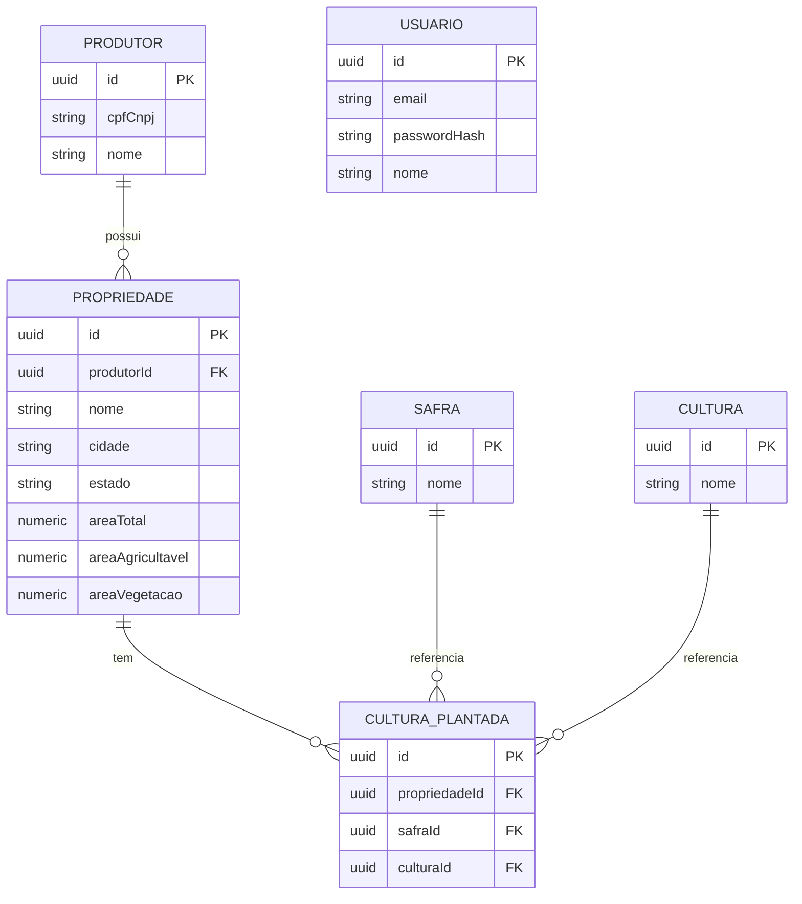

# Diagrama de Entidade-Relacionamento

> Revisado contra as entidades atuais em `backend/src/modules/**/entities/*.entity.ts`
> (inclui `Usuario`, usada só para autenticação — sem relação com o domínio de negócio).

`USUARIO` é isolada de propósito — existe só para o login (JWT), sem chave estrangeira
para o restante do domínio (produtores/propriedades não pertencem a um usuário).
